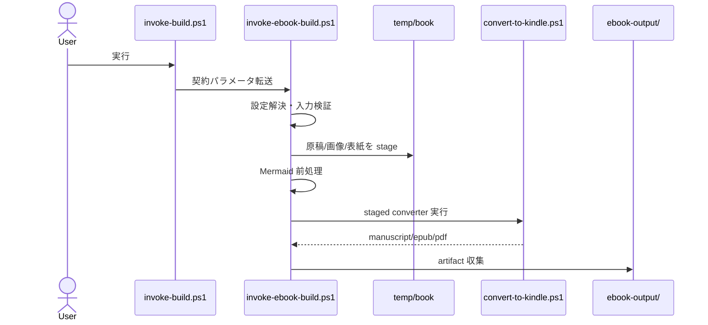
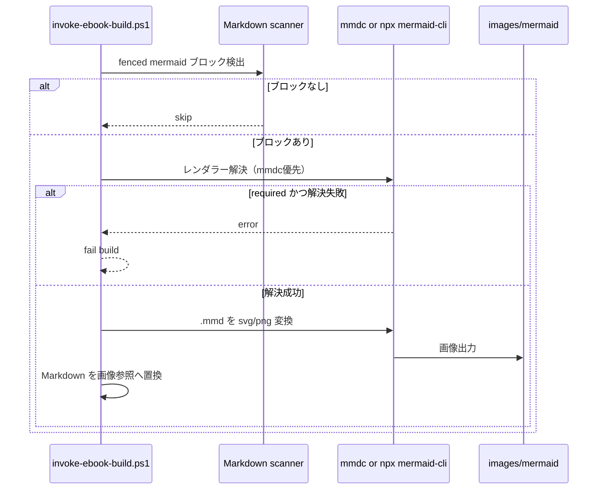
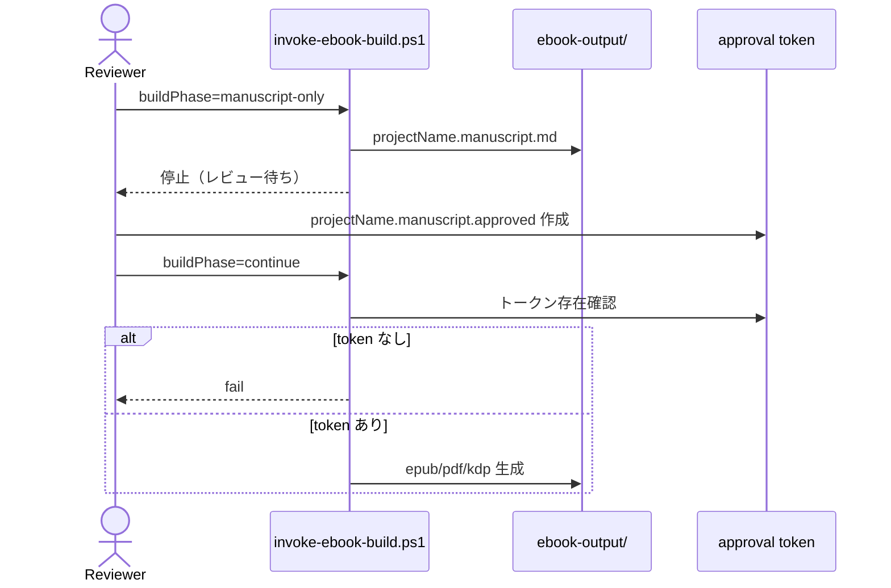

# Ebook Build 仕様書

## 目的

番号付き Markdown 原稿を共通契約でビルドし、以下の成果物を安定生成する。

- `projectName.manuscript.md`
- `projectName.epub`
- `projectName.pdf`
- `cover.pdf`
- `cover.jpg`
- `projectName-kdp-registration.md`

## consumer 設定契約

推奨 `*.build.json` 形:

```json
{
  "sourceRoot": ".",
  "outputDir": "./ebook-output",
  "projectName": "replace-with-project-name",
  "formats": ["epub", "pdf", "kdp-markdown"],
  "metadataFile": "./.github/skills-config/ebook-build/replace-with-project-name.metadata.yaml",
  "kdpMetadataFile": "./.github/skills-config/ebook-build/replace-with-project-name.kdp.yaml",
  "chapterDirPattern": "^\\d{2}-",
  "chapterFilePattern": "^\\d{2}-.*\\.md$",
  "coverFile": "00-COVER.md",
  "coverTemplateMode": "auto",
  "coverTemplate": "classic",
  "buildPhase": "full",
  "requireManuscriptApproval": false,
  "approvalTokenFile": "./ebook-output/replace-with-project-name.manuscript.approved",
  "generateManuscriptReviewReport": false,
  "manuscriptReviewReviewer": "automated-baseline",
  "manuscriptReviewDecision": "Approve",
  "mermaidMode": "required",
  "mermaidFormat": "svg",
  "failOnMermaidError": true
}
```

契約ルール:

- JSON パスは forward slash（`./...`）
- `styleFile` は通常未指定（shared default を使用）
- Mermaid 標準は `required` / `svg` / `true`
- `coverTemplateMode` は `auto|file|template`
- `buildPhase` は `full|manuscript-only|continue`
- `generateManuscriptReviewReport` は wrapper 後処理でレビュー記録を自動生成
- `manuscriptReviewDecision` は `Approve|Reject`

## wrapper 契約

consumer 側 wrapper:

```text
.github/skills-config/ebook-build/invoke-build.ps1
```

責務:

1. repo root 解決
2. `*.build.json` 読み込み
3. shared skill root 解決
4. 契約キーを `scripts/invoke-ebook-build.ps1` に透過転送

## 章・節契約

- 章ディレクトリ: `^\d{2}-`
- 節ファイル: `^\d{2}-.*\.md$`（章直下）
- `coverFile` は章列の外
- `README.md` は存在時に stage へコピー
- フラット `docs/*.md` は契約外

## ビルド全体フロー



## Mermaid 前処理フロー



## manuscript 承認ゲートフロー



## 表紙テンプレート契約

shared 側テンプレート配置:

```text
assets/cover-templates/
```

既定テンプレート:

- `classic.md`
- `minimal.md`
- `technical.md`

切替ルール:

- `coverTemplateMode=file`: `coverFile` 必須
- `coverTemplateMode=template`: テンプレートから `coverFile` を生成
- `coverTemplateMode=auto`: `coverFile` があれば優先、なければテンプレート生成

利用可能プレースホルダ:

- `{{title}}`
- `{{subtitle}}`
- `{{creator}}`
- `{{date}}`
- `{{projectName}}`

## 成果物動作

- `manuscript-only`: `projectName.manuscript.md` のみ収集して終了
- `continue`: 承認トークン確認後に本生成
- `full`: 従来どおり一括生成

## manuscript レビュー判定基準（厳密）

Severity:

- Critical: 出版可否に直結する欠陥（manuscript 未生成、承認ゲート破綻、重大文字化け、成果物欠落）
- Major: 品質低下が明確な欠陥（見出し階層崩れ、章順不整合、主要メタデータ不備）
- Minor: 軽微な改善事項（文言揺れ、注記不足）

承認ルール:

- 承認: Critical 0 件 かつ Major 3 件以下
- 不承認: Critical 1 件以上 または Major 4 件以上

レビュー実行順:

1. `buildPhase=manuscript-only` で manuscript を生成
2. 自動チェック（設定・構造・Mermaid・リンク・成果物）を実行
3. 手動レビュー（文章品質・図表可読性・コード体裁・権利表記）を実施
4. Issue を Critical/Major/Minor で集計
5. 承認時のみ `approvalTokenFile` を作成
6. `buildPhase=continue` で本生成を実行

Issue 記録最小項目:

- `ID`
- `Severity`
- `File/Section`
- `Observation`
- `Repro/Check Method`
- `Fix Recommendation`
- `Status`（Open/Resolved/Accepted Risk）

推奨テンプレート:

- `assets/review-templates/manuscript-review-report.template.md`

推奨生成コマンド（pwsh）:

```powershell
pwsh -NoProfile -ExecutionPolicy Bypass -File ./scripts/new-manuscript-review-report.ps1 -RepoRoot .
```

## エラー戦略（Hard fail）

- source root 未検出
- metadata/style/script 未検出
- chapter content 未検出
- Mermaid required で CLI 解決不可
- converter 非ゼロ終了
- 必須 artifact 未生成
- `continue` で承認トークン未検出

## 再利用範囲

この仕様は、章/節契約を満たす任意の consumer repo で再利用可能。  
consumer は `*.build.json` と `*.metadata.yaml` を責務として管理する。
