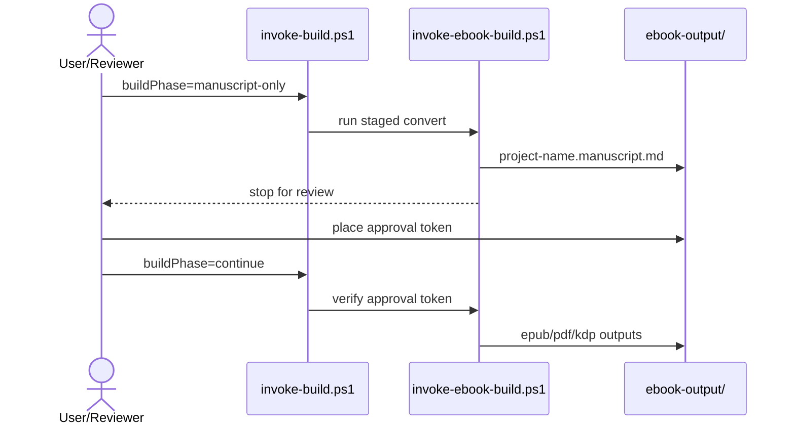

# Ebook Build Skill

## 目的

この Skill は、番号付き Markdown 構成の原稿から電子書籍成果物を生成するための共有ビルド基盤です。  
Copilot Agent から再利用できるように、非対話・契約駆動で実装されています。

## 前提ツール

- PowerShell 7+ (`pwsh`)
- Pandoc（PATH 上）
- PDF 生成時は Node.js と Chrome/Edge
- Mermaid 変換用 CLI（以下のどちらか）
  - `mmdc`
  - `npx @mermaid-js/mermaid-cli`

## 正式エントリースクリプト

- `./scripts/invoke-ebook-build.ps1`

## 入力インタフェース

| パラメータ | 必須 | 既定値 | 説明 |
|---|---|---|---|
| sourceRoot | Yes | - | 番号付き章ディレクトリを含む原稿ルート |
| outputDir | No | sourceRoot/ebook-output | 生成物出力先 |
| projectName | No | sourceRoot のフォルダ名 | 出力ファイル名のベース |
| formats | No | [epub] | `epub`, `pdf`, `kdp-markdown` |
| chapterDirPattern | No | ^\\d{2}- | 章ディレクトリ判定 |
| chapterFilePattern | No | ^\\d{2}-.*\\.md$ | 節ファイル判定 |
| coverFile | No | 00-COVER.md | 表紙 Markdown ファイル名 |
| coverTemplateMode | No | auto | `auto`, `file`, `template` |
| coverTemplate | No | classic | shared 側テンプレート名 |
| buildPhase | No | full | `full`, `manuscript-only`, `continue` |
| requireManuscriptApproval | No | false | `continue` 実行時に承認トークン必須化 |
| approvalTokenFile | No | outputDir/project-name.manuscript.approved | 承認トークンファイル |
| preserveTemp | No | false | 一時ディレクトリ保持 |
| metadataFile | No | ./.github/skills-config/ebook-build/<project>.metadata.yaml | メタデータ上書き |
| styleFile | No | shared 側 default | CSS 上書き |
| kdpMetadataFile | No | 自動解決 | KDP 補助メタデータ |
| mermaidMode | Yes | required | `off`, `auto`, `required` |
| mermaidFormat | Yes | svg | `svg`, `png` |
| failOnMermaidError | Yes | true | Mermaid 失敗時に停止 |
| configFile | No | - | consumer 側 JSON 設定 |

## Mermaid 標準ポリシー

- 標準値は `required` / `svg` / `true`
- 解決順は `mmdc` → `npx @mermaid-js/mermaid-cli`
- 変換後は `images/mermaid/` に画像配置し、原稿内の Mermaid ブロックを画像参照へ置換

## 2段階承認フロー（manuscript）

1. `buildPhase=manuscript-only` で `project-name.manuscript.md` を生成して停止
2. 原稿レビュー後、承認トークンを配置
3. `buildPhase=continue` で本生成を継続

## 出力成果物

- `project-name.manuscript.md`
- `project-name.epub`
- `project-name.pdf`
- `cover.pdf`
- `cover.jpg`
- `project-name-kdp-registration.md`

## consumer 側契約

- `./.github/skills-config/ebook-build/<repo>.build.json`
- `./.github/skills-config/ebook-build/<repo>.metadata.yaml`
- `./.github/skills-config/ebook-build/invoke-build.ps1`

## 参照仕様

- 詳細仕様: `./EBOOK_BUILD_SPECIFICATION.md`
- 検証基準: `./VALIDATION_CHECKLIST.md`
