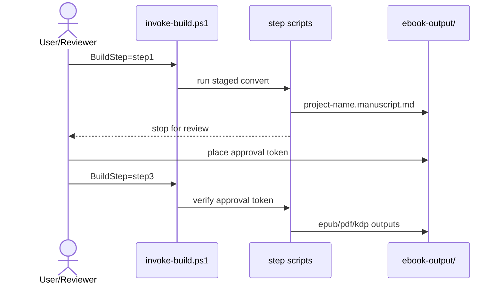

# Ebook Build Skill

## 目的

この Skill は、番号付き Markdown 構成の原稿から電子書籍成果物を生成するための共有ビルド基盤です。  
Copilot Agent から再利用できるように、非対話・契約駆動で実装されています。

## 前提ツール

- PowerShell 7+ (`pwsh`)
- Pandoc（PATH 上）
- PDF 生成時は Node.js と Chrome/Edge
- Mermaid 変換用 CLI（以下のどちらか）
  - `mmdc`
  - `npx @mermaid-js/mermaid-cli`

## 正式エントリースクリプト

- `./scripts/invoke-ebook-step1-manuscript.ps1`
- `./scripts/invoke-ebook-step2-cover.ps1`
- `./scripts/invoke-ebook-step3-finalize.ps1`
- `./scripts/invoke-ebook-step2b-paperback-cover.ps1`  ← KDP Paperback 入稿用（step3 完了後）

## 入力インタフェース

| パラメータ | 必須 | 既定値 | 説明 |
|---|---|---|---|
| sourceRoot | Yes | - | 番号付き章ディレクトリを含む原稿ルート |
| outputDir | No | sourceRoot/ebook-output | 生成物出力先 |
| projectName | No | sourceRoot のフォルダ名 | 出力ファイル名のベース |
| formats | No | [epub] | `epub`, `pdf`, `kdp-markdown` |
| paperbackBackColor | No | #0b1220 | Paperback 裏表紙・背表紙の背景色（hex） |
| paperbackSpineColor | No | (backColor と同じ) | 背表紙のみ別色にする場合 |
| paperbackFontPath | No | 自動検出 | 背表紙テキスト用 CJK フォントパス（TTF/TTC） |
| chapterDirPattern | No | ^\\d{2}- | 章ディレクトリ判定 |
| chapterFilePattern | No | ^\\d{2}-.*\\.md$ | 節ファイル判定 |
| coverFile | No | 00-COVER.md | 表紙 Markdown ファイル名 |
| coverTemplateMode | No | auto | `auto`, `file`, `template` |
| coverTemplate | No | classic | shared 側テンプレート名 |
| normalizeManuscript | No | false | step1 後に共有正規化フックを実行 |
| requireManuscriptApproval | No | false | `BuildStep=step3` 実行時に承認トークン必須化 |
| approvalTokenFile | No | outputDir/project-name.manuscript.approved | 承認トークンファイル |
| preserveTemp | No | false | 一時ディレクトリ保持 |
| metadataFile | No | ./.github/skills-config/ebook-build/<project>.metadata.yaml | メタデータ上書き |
| styleFile | No | shared 側 default | CSS 上書き |
| kdpMetadataFile | No | 自動解決 | KDP 補助メタデータ |
| mermaidMode | Yes | required | `off`, `auto`, `required` |
| mermaidFormat | Yes | svg | `svg`, `png` |
| failOnMermaidError | Yes | true | Mermaid 失敗時に停止 |
| configFile | No | - | consumer 側 JSON 設定 |

## Mermaid 標準ポリシー

- 標準値は `required` / `svg` / `true`
- 解決順は `mmdc` → `npx @mermaid-js/mermaid-cli`
- 変換後は `images/mermaid/` に画像配置し、原稿内の Mermaid ブロックを画像参照へ置換

## KDP Paperback カバー（step2b）

step3 完了後に `BuildStep=step2b` を実行する。`kdp.yaml` から `trimSize` と `paperType` を読み取り、PDFページ数から背表紙幅を自動計算して全面折り返しカバーPDFを生成する。

| kdp.yaml キー | 必須 | 既定値 | 説明 |
|---|---|---|---|
| trimSize | Yes | - | トリムサイズ（例: `"6in x 9in"`） |
| paperType | No | white | `white` / `cream` / `color-standard` / `color-premium` |

背表紙幅の係数：

| paperType | 係数（インチ/ページ） |
|---|---|
| white | 0.002252 |
| cream | 0.0025 |
| color-standard | 0.002252 |
| color-premium | 0.002347 |

### 実行順序

```
BuildStep=step1  → BuildStep=step2  → BuildStep=step3  → BuildStep=step2b
```

### 出力

- `paperback-cover.pdf`（RGB）
- `paperback-cover-cmyk.pdf`（Ghostscript がある場合のみ、CMYK変換済み）

### 前提ツール（step2b 追加分）

- Python 3 + Pillow（自動インストール）
- Node.js（pdf-lib は既存 node_modules を使用）
- Ghostscript（省略可、CMYK 変換時のみ使用）

## 2段階承認フロー（manuscript）

1. `BuildStep=step1` で `project-name.manuscript.md` を生成して停止
2. 原稿レビュー後、承認トークンを配置
3. `BuildStep=step3` で本生成を継続



## 出力成果物

| ファイル | 生成ステップ | 用途 |
|---|---|---|
| `project-name.manuscript.md` | step1 | 原稿レビュー用 |
| `project-name.epub` | step3 | Kindle 電子書籍 |
| `project-name.pdf` | step3 | PDF 版 |
| `cover.jpg` / `cover.png` | step2 | EPUB 埋め込み表紙 |
| `project-name-kdp-registration.md` | step3 | KDP 登録メモ |
| `paperback-cover.pdf` | step2b | **KDP Paperback 入稿用全面カバー** |
| `paperback-cover-cmyk.pdf` | step2b | 同上（CMYK変換済み、Ghostscript必要） |

## consumer 側契約

- `./.github/skills-config/ebook-build/<repo>.build.json`
- `./.github/skills-config/ebook-build/<repo>.metadata.yaml`
- `./.github/skills-config/ebook-build/invoke-build.ps1`

## 参照仕様

- 詳細仕様: `./EBOOK_BUILD_SPECIFICATION.md`
- 検証基準: `./VALIDATION_CHECKLIST.md`
