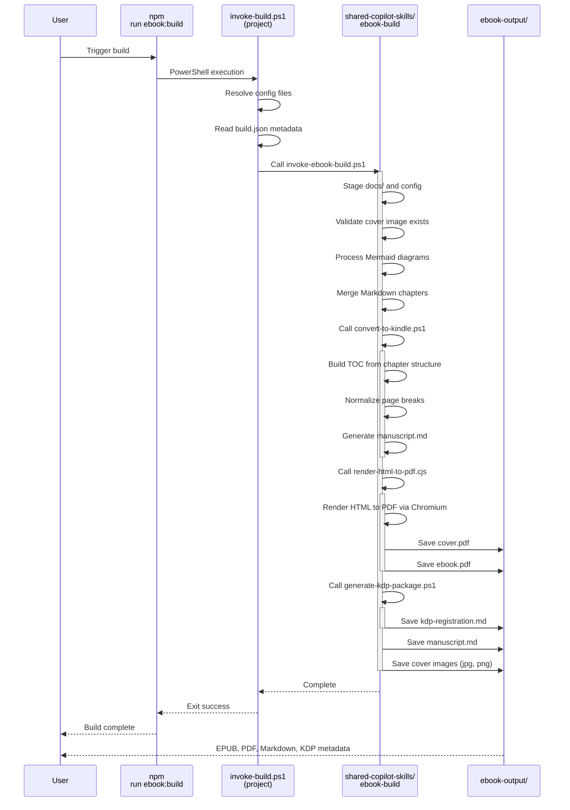
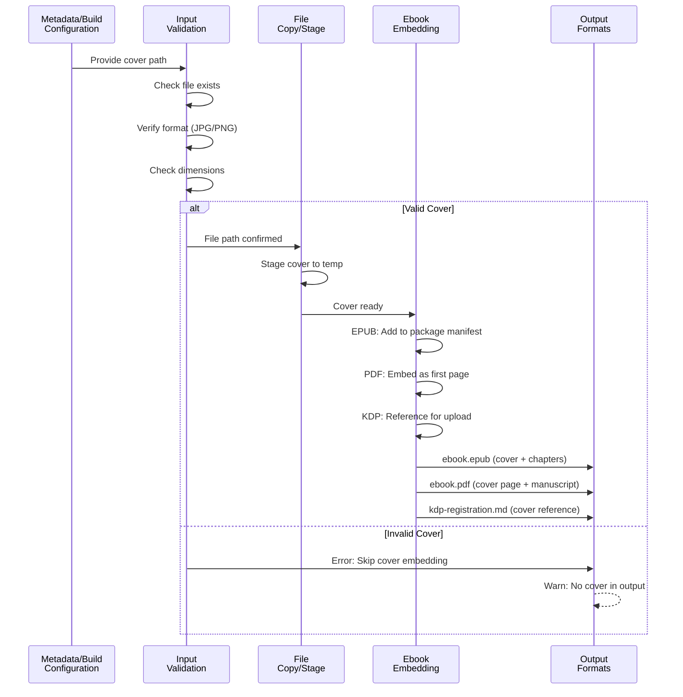
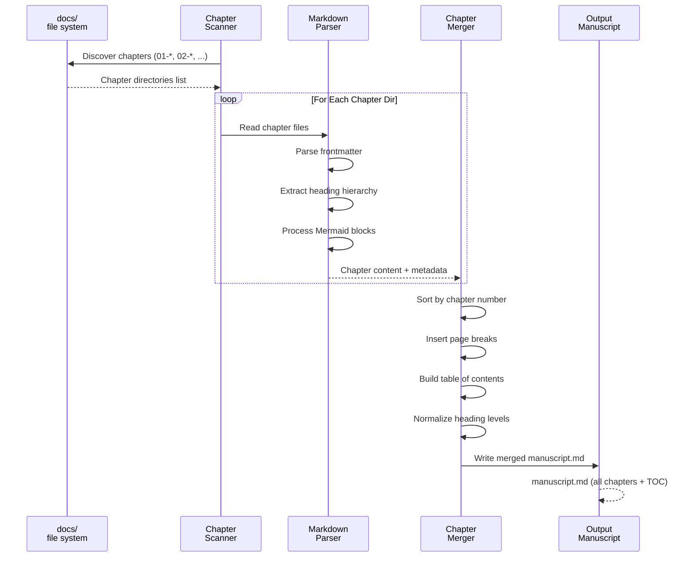
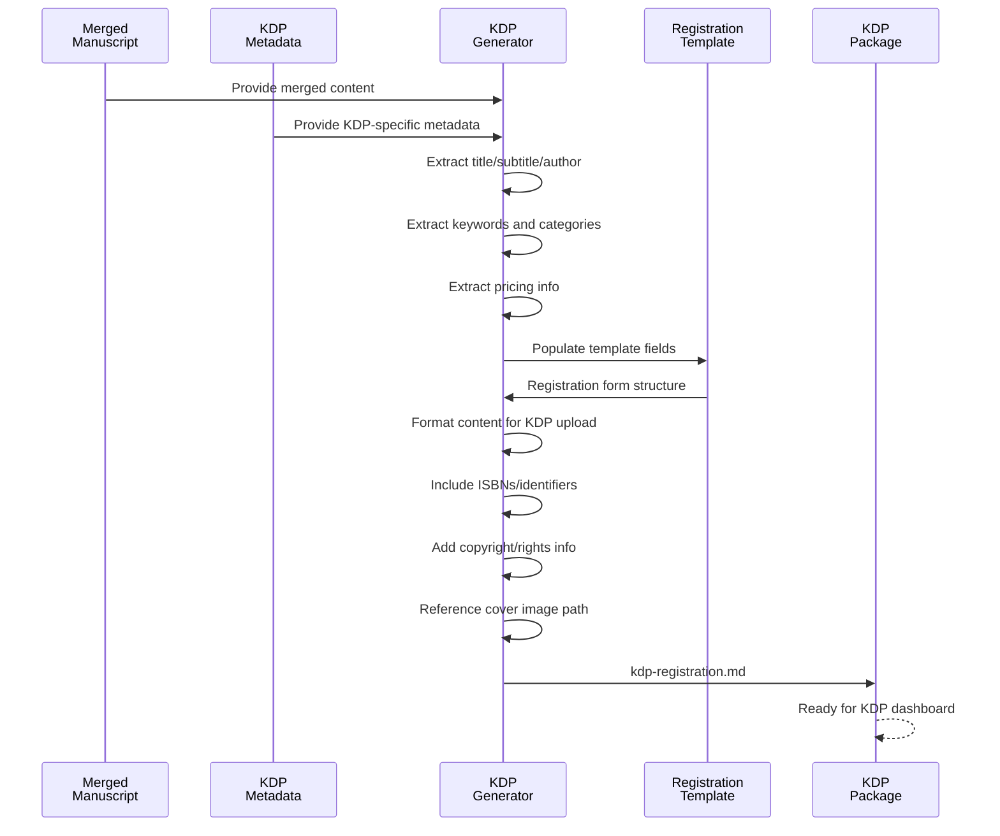
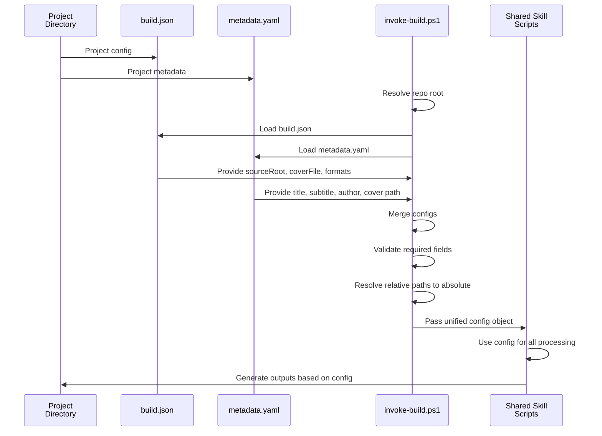
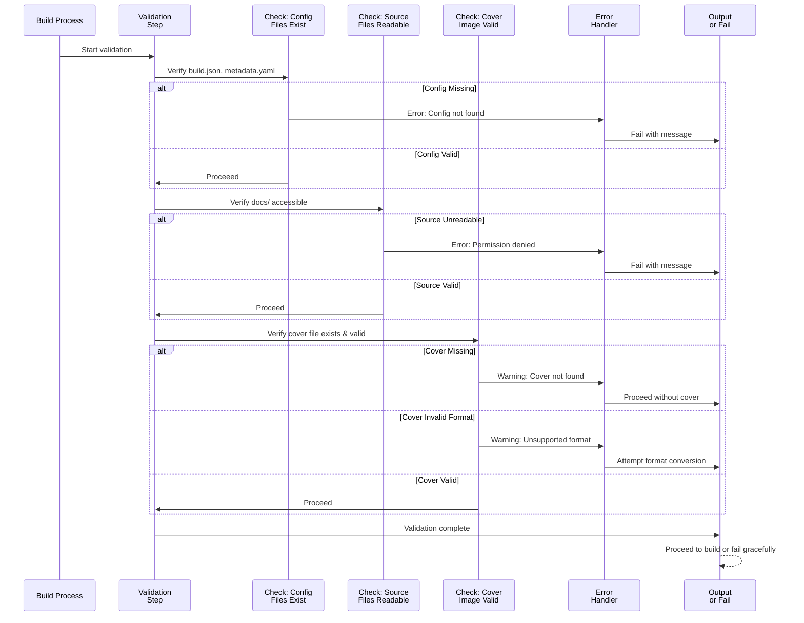

# Ebook Generation Process - Sequence Diagrams

This document illustrates the ebook generation workflow using Mermaid sequence diagrams.

## 1. Overall Ebook Build Process

## 2. Cover Image Handling Pipeline

## 3. Markdown Chapter Discovery and Merging

## 4. KDP Registration Package Generation

## 5. Configuration Flow

## 6. Error Handling and Validation

---

## Configuration Reference

### build.json Fields
- `projectName`: Project identifier
- `sourceRoot`: Location of chapter Markdown files
- `outputDir`: Output directory for generated files
- `coverFile`: Path to cover image file
- `metadataFile`: Path to metadata.yaml
- `formats`: Array of output formats (epub, pdf, kdp-markdown)

### metadata.yaml Fields
- `title`: Book title
- `subtitle`: Book subtitle
- `creator`: Author name
- `cover`: Path to cover image file
- `language`: Language code (e.g., ja-JP)
- `description`: Book description
- `rights`: Copyright/license text

---

**Last Updated**: 2026-04-12  
**Diagrams Version**: 1.0
