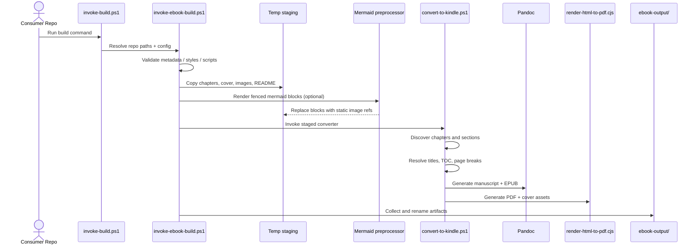
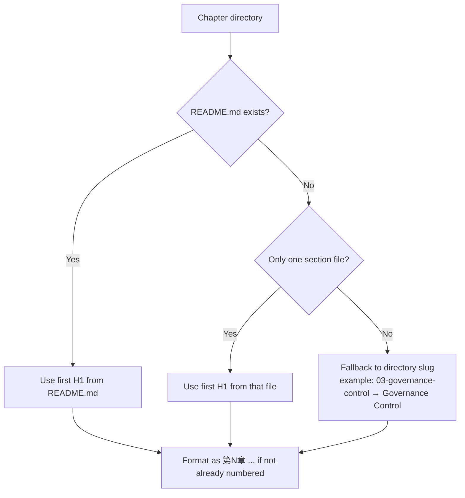
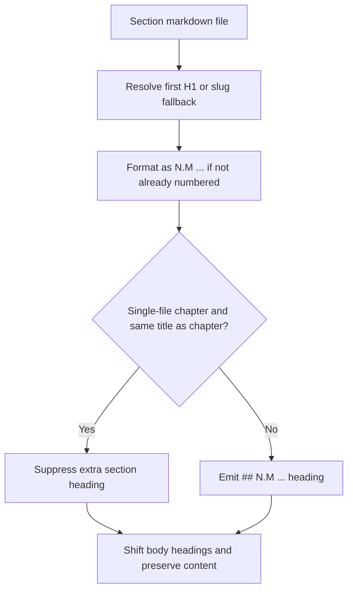

# Ebook Generation Pipeline (Current Behavior)

> This document describes the **current** shared ebook generation behavior used by repositories that depend on `shared-copilot-skills/ebook-build`. It is intended as a debugging reference for chapter title resolution, section rendering, page breaks, TOC generation, Mermaid preprocessing, and output collection.

## 1. Scope and primary artifacts

### Inputs
- Consumer wrapper: `.github/skills-config/ebook-build/invoke-build.ps1`
- Consumer config: `.github/skills-config/ebook-build/<project>.build.json`
- Consumer metadata: `.github/skills-config/ebook-build/<project>.metadata.yaml`
- Optional KDP metadata: `.github/skills-config/ebook-build/<project>.kdp.yaml`
- Markdown source under `docs/` or configured `sourceRoot`
- Optional cover file such as `00-COVER.md`

### Main outputs
- `<project>.manuscript.md`
- `<project>.epub`
- `<project>.pdf`
- `cover.pdf`
- `cover.jpg`
- `<project>-kdp-registration.md`

## 2. Entry points and responsibilities

| File | Responsibility |
|---|---|
| `scripts/invoke-ebook-build.ps1` | Resolve config, validate inputs, stage content, preprocess Mermaid, collect artifacts |
| `scripts/convert-to-kindle.ps1` | Discover chapters/sections, resolve display titles, build merged manuscript, generate TOC, normalize page breaks |
| `scripts/render-html-to-pdf.cjs` | Render fixed-layout PDF and cover assets via local Chromium/Edge |
| `scripts/generate-kdp-package.ps1` | Produce KDP registration markdown |
| `assets/style.css` / `assets/print.css` | EPUB / PDF page-break and typography behavior |

## 3. End-to-end sequence



## 4. Stage-by-stage behavior

### 4.1 Consumer wrapper
The consumer repository entry script resolves repository-local paths and delegates to the shared runner. This allows multiple repositories to reuse the same build logic while keeping only config and metadata local.

### 4.2 Shared runner (`invoke-ebook-build.ps1`)
The shared runner performs the following in order:

1. merge CLI parameters, JSON config, and default values
2. resolve `sourceRoot` and fall back to `sourceRoot/docs` when needed
3. verify required files such as metadata, stylesheets, and converter scripts
4. create a temporary staging workspace
5. stage markdown content, images, cover, and root `README.md`
6. optionally preprocess Mermaid diagrams
7. run the staged converter
8. collect artifacts into `ebook-output/`

### 4.3 Mermaid preprocessing
When `mermaidMode` is `auto` or `required`, the runner scans staged markdown for fenced `mermaid` blocks and tries to render them using:

1. `mmdc`
2. `npx @mermaid-js/mermaid-cli`

If rendering is unavailable:
- `auto`: warn and continue
- `required`: fail the build

### 4.4 Detailed merge process: multiple Markdown files → one manuscript
This is the most important transformation step in the pipeline. The shared build does **not** pass all source files directly to the final converters as-is. Instead, it assembles one normalized manuscript in memory and writes it out as `<project>.manuscript.md`.

The core functions involved are:
- `Get-ChapterEntries`
- `New-BookLinkMap`
- `Get-CoverBodyLines`
- `Get-SectionBodyLines`
- `New-BookManuscript`
- `New-PdfReaderManuscript`

```mermaid
sequenceDiagram
    participant Runner as invoke-ebook-build.ps1
    participant Convert as convert-to-kindle.ps1
    participant Chapters as Get-ChapterEntries
    participant Links as New-BookLinkMap
    participant Cover as Get-CoverBodyLines
    participant Section as Get-SectionBodyLines
    participant Manuscript as New-BookManuscript / New-PdfReaderManuscript
    participant Output as book.manuscript.md

    Runner->>Convert: Start staged conversion
    Convert->>Chapters: Discover chapter dirs and section files
    Convert->>Links: Build path-to-anchor map
    Convert->>Manuscript: Create empty manuscript line buffer
    alt cover file exists
        Manuscript->>Cover: Read and normalize cover block
        Cover-->>Manuscript: Cover lines + anchor + page break
    end
    loop each chapter in sorted order
        Manuscript->>Manuscript: Add chapter H1 with anchor
        loop each section file in sorted order
            Manuscript->>Section: Read section body
            Section->>Section: Remove first H1 from source file
            Section->>Section: Shift lower headings to fit merged hierarchy
            Section->>Section: Normalize page-break markers
            Section->>Section: Rewrite relative markdown links to anchors
            Section-->>Manuscript: Return normalized body lines
            Manuscript->>Manuscript: Optionally emit section H2 heading
        end
        Manuscript->>Manuscript: Insert blank line / chapter break
    end
    Manuscript->>Output: Write merged manuscript to temp/output
```

### 4.5 What the merge step actually changes
When the manuscript is assembled, the build intentionally rewrites source structure to make the final ebook consistent:

| Input behavior | Merged manuscript behavior |
|---|---|
| Cover file is separate | Cover content is placed at the top with a cover anchor |
| Each section file may start with its own `# ...` | The first H1 in each section file is removed from the body to avoid double top-level headings |
| Lower headings are relative to the source file | H2+ headings are shifted to fit the merged chapter/section hierarchy |
| Relative links point to neighboring markdown files | Links are rewritten to internal anchors using the chapter/section link map |
| Different page-break notations may appear in source | All supported markers are normalized to `<div class="page-break"></div>` |
| Multiple files exist under one chapter directory | They are emitted in sorted order into a single continuous manuscript |

In practice, the merged manuscript is built in this order:

1. optional cover content
2. page break after the cover/front matter
3. chapter H1 (`# 第N章 ...`)
4. optional section H2 (`## N.M ...`)
5. normalized section body
6. repeat for all sections and chapters

### 4.6 EPUB manuscript vs PDF manuscript
There are two closely related assembly paths:

- `New-BookManuscript` → used for the standard merged manuscript and EPUB conversion
- `New-PdfReaderManuscript` → adds frontmatter TOC and PDF-specific page breaks before rendering the PDF

Both paths share the same chapter and section merge behavior, so title-resolution bugs or redundant heading behavior usually reproduce in both outputs.

## 5. Title resolution rules

### 5.1 Chapter title resolution



Current rule set:
- Prefer the first H1 from `README.md` under the chapter directory.
- If there is no chapter `README.md`, the runner next checks the first section title. When that title already looks like a chapter heading such as `第3章 ...`, it is reused as the chapter title even in a multi-file chapter.
- If there is no suitable chapter-style heading and only one section file exists, use that file's first H1.
- If multiple section files exist and no chapter-level heading can be inferred, fall back to the directory slug.
- If the chapter title does not already begin with `第N章`, the merged manuscript formats it as `第N章 ...`.
- The numeric values are taken directly from the source prefixes, not renumbered. For example, a chapter directory named `00-fundamentals` renders as `第0章 ...`, and a section file named `00-four-concepts.md` under chapter 2 renders as `## 2.0 ...`.
- Implementation note: in PowerShell string interpolation, `第${chapterNumber}章 ...` must use braces. Writing `第$chapterNumber章 ...` can be parsed as `$chapterNumber章` and drop both the number and the literal `章`.

### 5.2 Section title resolution and rendering



Current rule set:
- Section titles prefer each file's first H1.
- If no H1 exists, the file slug is used as a fallback.
- Sections are formatted as `N.M ...` when a numeric prefix is not already present.
- If the first section title is effectively the same as the chapter title, the extra `## ...` line may be suppressed to avoid duplicate headings. This can apply to single-file chapters and to the lead section in a multi-file chapter.
- When suppression happens for the lead section of a multi-file chapter, the body headings are still nested under a virtual `N.1` section so later section files such as `N.2`, `N.3` do not collide with earlier headings.

## 6. TOC and page-break behavior

### TOC
- `toc-depth` is read from metadata YAML.
- PDF frontmatter TOC is generated before the body.
- EPUB TOC is produced by Pandoc from the merged manuscript hierarchy.

### Page breaks
The current shared build normalizes these forms into `<div class="page-break"></div>`:
- `<!-- pagebreak -->`
- `<!-- page-break -->`
- `<!-- newpage -->`
- `<!-- ebook:pagebreak -->`
- `\pagebreak`
- `\newpage`
- `\clearpage`
- `<div class="page-break"></div>`

Automatic page-break insertion points:
- after the cover/front matter block
- after the PDF front TOC block
- between chapters

## 7. Output collection

The shared runner copies the final staged artifacts into the consumer repository's `ebook-output/` folder and uses `projectName` as the base name. If a destination artifact is locked, the runner can fall back to a timestamped name.

## 8. Debugging findings for the chapter-title issue

The investigation confirmed two separate causes behind the previously confusing chapter 3 output:

1. **Chapter-title fallback path**  
   When a chapter directory has multiple section files and no chapter `README.md`, the older logic could fall back to the directory slug instead of promoting a chapter-style H1 from the lead section.

2. **PowerShell interpolation pitfall**  
   A string such as `"第$chapterNumber章 $baseTitle"` is parsed incorrectly in PowerShell and can produce output like `第 Governance Control`. The correct form is `"第${chapterNumber}章 $baseTitle"`.

With the current verified behavior:
- if the lead section already begins with `# 第3章 ...`, that heading can be promoted to the chapter title even in a multi-file chapter
- if the lead section title and the resolved chapter title are effectively the same, the extra first `## ...` heading is suppressed to reduce redundancy

The verified output shape now looks like:

```md
# 第3章 ガバナンスとリスク統制
## 3.1 本文
```

This is now the intended reference behavior for the investigated case.
