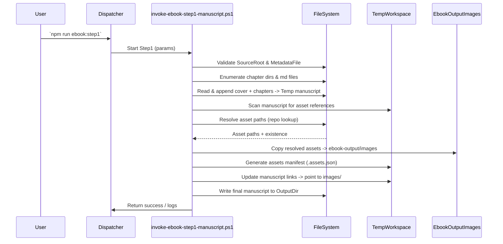

# invoke-ebook-step1-manuscript.ps1 仕様書

## 概要
`invoke-ebook-step1-manuscript.ps1` は教材リポジトリの Markdown ソースをマージして単一の原稿ファイルを生成し、関連する画像などのアセットを収集・格納し、原稿内リンクを収集先に書き換えるビルドステップ（Step1）を実行します。

## 目的
- `docs` 配下の章ファイルを順次マージして `manuscript.md` を生成する
- 参照される画像やスクリーンショット等アセットを収集して `ebook-output/images/` に配置する
- マニュスクリプト内の相対パスを収集先に書き換える

## 入力パラメータ
- `SourceRoot`: docs ディレクトリ（例: C:\Dev\tutorials\...\docs）
- `OutputDir`: 出力ルート（例: .\ebook-output）
- `ProjectName`: 出力ファイル名のベース
- `MetadataFile`: プロジェクトメタデータ（YAML）
- `CollectAssets` (bool): アセット収集を行うか
- そのほかオプション: `NumberHeadings`, `PreserveTemp`, `ChapterDirPattern` など

## 出力
- manuscript: `{OutputDir}/{ProjectName}.manuscript.md`
- 画像出力: `{OutputDir}/images/...`
- アセットマニフェスト: `{ProjectName}.assets.json` (Temp もしくは OutputDir)
- ログ・デバッグファイル（`PreserveTemp` 時）

## 高レベル処理フロー
1. 引数検証（SourceRoot, MetadataFile 等）
2. コンテンツルートを解決し章ディレクトリを列挙
3. カバー(cover) の挿入
4. 章ファイルを読み込み、見出し番号付与や整形を行いつつマージ
5. manuscript を一時書き出し
6. マニュスクリプトから画像/資産参照を抽出
7. 参照をリゾルブして `ebook-output/images` にコピーし、manifest エントリを作成
8. マニフェストを読み、原稿内の `examples/...` 参照を `images/...` に置換
9. 最終稿を出力、必要に応じてバックアップや debug ファイルを書き出す

## アセット解決ルール（要点）
- Markdown の `` と HTML `` を検出
- 相対パスは Markdown ファイル基準で解決
- Windows パスは内部で正規化して POSIX スタイル (`/`) に変換
- 参照が見つからない場合は manifest に `missing` として記録

## 既知の注意点
- パス区切りとエスケープ：コピー時は OS のパス区切りでハンドリングし、マークダウンへの書き戻しは `/` に統一する
- マニフェスト値は検証・正規化してから置換に使うこと（`\` を `/` に置換）
- コードフェンス内は置換しない（意図しない書換を防止）

## エラーハンドリング
- 重大な検証失敗は例外で中断（例: MetadataFile が見つからない）
- 個別アセットの未解決は警告扱いで処理継続（`missing` を manifest に保存）

## 実行例
```powershell
pwsh -NoProfile -ExecutionPolicy Bypass -File shared-copilot-skills\ebook-build\scripts\invoke-ebook-step1-manuscript.ps1 \
  -SourceRoot 'C:\Dev\tutorials\generative-ai-oss-tutorials\docs' \
  -OutputDir 'C:\Dev\tutorials\generative-ai-oss-tutorials\ebook-output' \
  -ProjectName generative-ai-oss-tutorials \
  -MetadataFile 'C:\Dev\tutorials\generative-ai-oss-tutorials\.github\skills-config\ebook-build\generative-ai-oss-tutorials.metadata.yaml' \
  -CollectAssets:$true -PreserveTemp:$true -Verbose
```

## Mermaid シーケンス図


## ステップ毎説明
- 引数検証: `SourceRoot` と `MetadataFile` の存在を `Ensure-Path` で確認
- 章列挙: `ChapterDirPattern` に合致するディレクトリから Markdown ファイルを収集してソート
- マージ: カバー（ある場合）→ 章ファイルを順に読み出して `manuscript` に追記
- アセット抽出: 正規表現で `` と `` をスキャンし、`Get-NormalizedAssetReference` で正規化
- 参照解決: `Join-Path` と `Path.GetFullPath` で `sourcePath` を決定し `AssetMap` と `assetManifest` に登録
- コピー: `Copy-CollectedAssets` で `images` ディレクトリ配下にファイルを作成（`/` を `\` に置換してファイルシステムパスにする）
- manifest 生成: `ConvertTo-Json` で `.assets.json` を作成
- リンク更新: `Update-ManuscriptLinks` が manifest を読み `map` を構成、各行ごとにキーをエスケープして `images/<outRel>` に置換

## 改善提案
- マニフェスト生成時に `outputRelativePath` を `/` で正規化する
- `Update-ManuscriptLinks` を簡素化してキー単位の安全な置換を行う
- `PreserveTemp` が有効なときの一時ファイル保存とログ出力を充実させる

## 付録: トラブルシュート手順
1. `assets.json` の当該エントリを確認する
2. マニフェストの `outputRelativePath` が期待どおりか確認（`/` を使用）
3. `manuscript.md` の該当行が manifest キーと一致しているか検査
4. `Update-ManuscriptLinks` のログ（replaced=）を確認する

