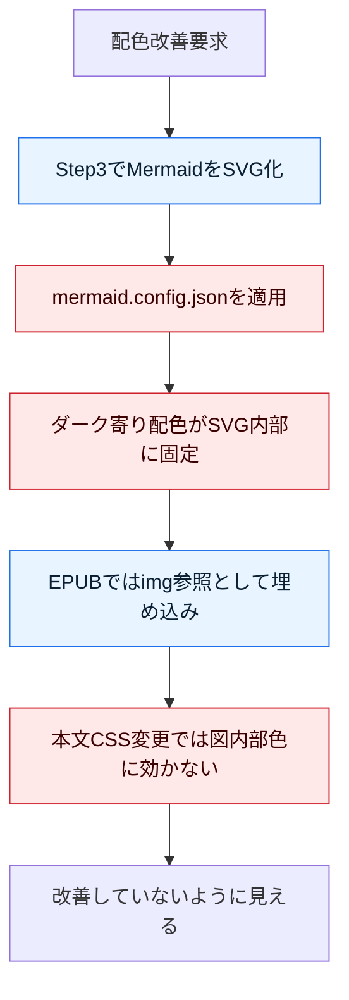

# 5.2 Mermaid 配色課題の仕様整理と原因分析

## 結論
EPUB の Mermaid 図配色が改善されない主因は、EPUB 向けの Mermaid レンダリング設定がダーク前提のまま固定されていることです。さらに、EPUB 本文 CSS 側で後から配色を上書きできない構造のため、設定変更の効き先を誤ると改善が反映されません。

## 1. 目的と範囲
### 1.1 目的
- `github-copilot-developer-tutorial.epub` の Mermaid 図で「配色改善が見えない」事象を仕様として定義する
- 原因を工程と実装に分解して可視化する
- 実行可能な対応策を比較し、推奨案を決める

### 1.2 対象
- EPUB 生成物: `ebook-output/github-copilot-developer-tutorial.epub`
- ビルド設定: `.github/skills-config/ebook-build/github-copilot-developer-tutorial.build.json`
- Mermaid 設定: `.github/skills-config/ebook-build/mermaid.config.json`
- 最終化スクリプト: `shared-copilot-skills/ebook-build/scripts/invoke-ebook-step3-finalize.ps1`

### 1.3 非対象
- PDF の色最適化
- 章本文の文言や図構成そのものの改善

## 2. 現行仕様（実装ベース）
### 2.1 Mermaid 変換フロー
1. Step3 で Markdown 内の Mermaid コードブロックを検出
2. `mmdc`（または `npx @mermaid-js/mermaid-cli`）で SVG 生成
3. Markdown の Mermaid コードブロックを画像参照に置換
4. pandoc で EPUB を生成

### 2.2 EPUB 内での参照構造
- Mermaid 図は `EPUB/media/fileN.svg` として格納される
- 章 XHTML 側は `` 参照になる
- EPUB 共通 CSS (`EPUB/styles/stylesheet1.css`) は本文スタイルを持つが、外部 SVG 内部の配色ロジック自体は直接制御しない

## 3. 観測事実
### 3.1 Mermaid 設定がダーク寄り
`mermaid.config.json` で以下のように暗色系が指定されている。
- `background: #0f0f0f`
- `mainBkg: #1e293b`
- `textColor: #e8e8e8`
- `lineColor: #58a6ff`

### 3.2 生成 SVG へ配色が焼き込まれている
EPUB 内 `EPUB/media/file0.svg` には、次が確認できる。
- `fill:#e8e8e8`（既定テキスト色）
- `node rect ... fill:#1e293b`（既定ノード背景）
- `stroke:#58a6ff`（既定線色）

### 3.3 EPUB 側の参照は画像で固定
`EPUB/text/ch00x.xhtml` では Mermaid は `` 参照化されるため、本文 CSS だけでは図内部配色を改善しにくい。

## 4. 原因の可視化

## 5. 真因の整理
### 真因1（最優先）
EPUB 向け Mermaid 設定値が、白背景の読書体験に対して暗色バランス最適化されていない。

### 真因2（構造要因）
Mermaid はコードブロックのままではなく外部 SVG 画像に変換されるため、EPUB 本文 CSS の変更だけでは配色改善効果が出ない。

### 真因3（運用要因）
配色改善の検証ポイントが「設定変更後に EPUB 内 SVG を確認する」運用になっていない。

## 6. 対応策の比較
| 案 | 内容 | 効果 | リスク | 工数 |
|---|---|---|---|---|
| A | `mermaid.config.json` を EPUB 向け配色へ再設計（ライト前提） | 高 | 既存図の見え方変化 | 小 |
| B | EPUB 専用 Mermaid 設定ファイルを分離し、Step3 で切替 | 高 | 設定ファイル増加による管理負荷 | 中 |
| C | 図ごとに `classDef/style` を強制指定して既定色依存を下げる | 中 | 図メンテ工数増加 | 中〜大 |
| D | SVG 後処理で色置換 | 中 | 図種別差分で破綻しやすい | 大 |

## 7. 推奨方針
### 推奨
案 B を採用し、短期は案 A の色調整を先行する。

### 理由
- 影響範囲を EPUB に限定できる
- PDF/他出力の配色方針と独立管理できる
- 将来のダークテーマ向け出力にも拡張しやすい

## 8. 実施ステップ（提案）
1. EPUB 用 Mermaid 設定ファイルを追加する（例: `mermaid.epub.config.json`）
2. `build.json` の `mermaidConfigFile` を EPUB 用へ切替する
3. `npm run ebook:step3` を実行して EPUB 再生成する
4. EPUB 内 `EPUB/media/file*.svg` の既定テキスト色と既定ノード色を確認する
5. 主要 5 図で可読性確認し、閾値を満たすまで色を微調整する

## 9. 受け入れ基準
- 図内テキストが白背景で読める（既定ノード/エッジラベル含む）
- 章をまたいでも配色一貫性がある
- 既存の `classDef` 指定色が意図どおり維持される
- EPUB 生成が失敗しない

## 10. 決定ログ
- 2026-05-01: 初版作成（仕様整理、原因可視化、対応案比較）